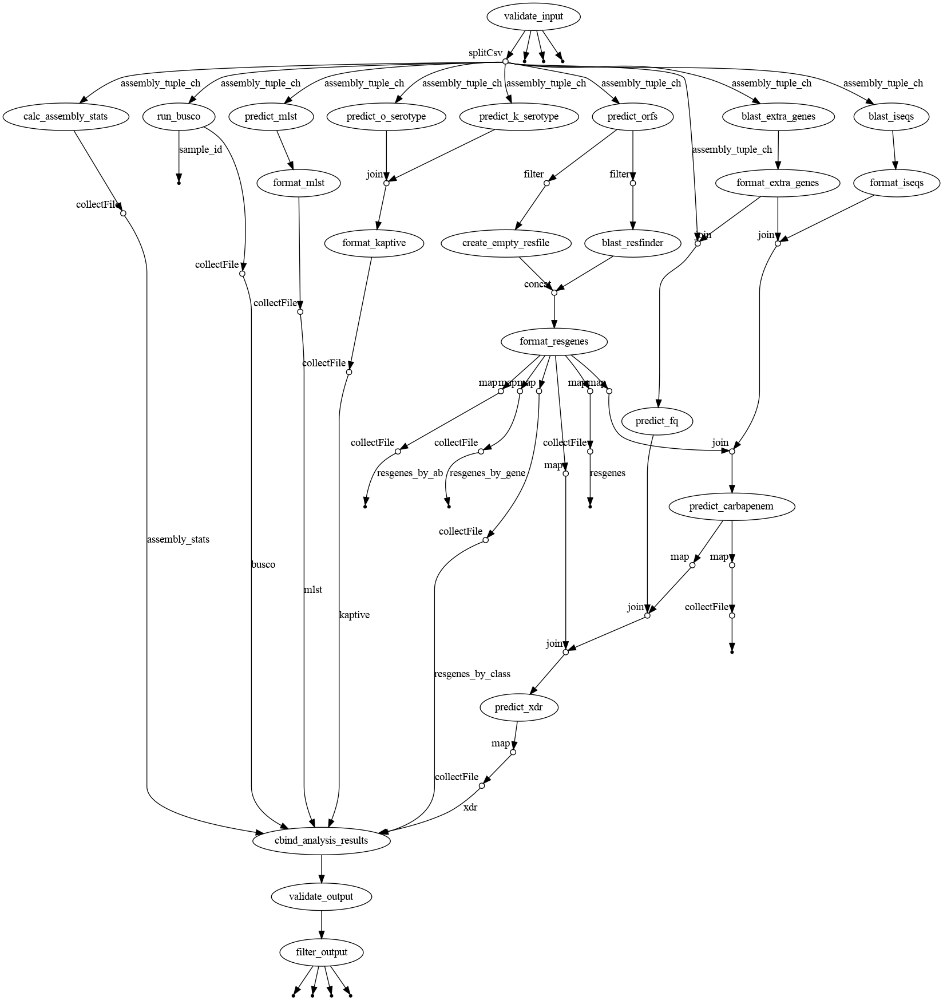
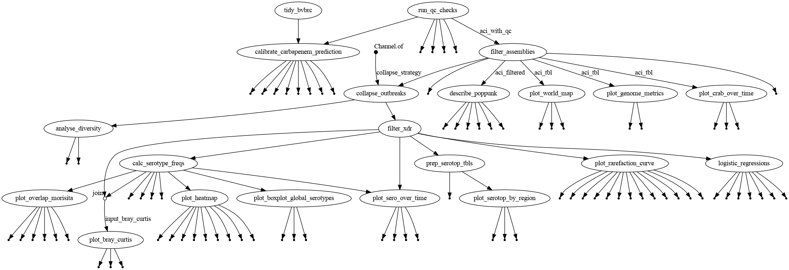

<!-- README.md is generated from README.Rmd. Please edit that file -->

```{r echo=FALSE}
knitr::opts_chunk$set(
  warning = FALSE, 
  message = FALSE,
  collapse = TRUE,
  comment = "#>",
  fig.path = "man/figures/README-",
  out.width = "100%",
  cache = TRUE
)
```
# aci
<!-- badges: start -->

This repository contains all pipelines and scripts for the article:
<TODO: ARTICLE REFERENCE HERE>

## Repository Structure

This repository contains:

* A pipeline launcher for predicting a number of genomic features for a set of A. baumannii genomes (main.nf)
* A pipeline launcher for analysing a set of A. baumannii genomes with genomic features (post.nf)

The pipelines use both published software tools and also code developed for this project.

* Scripts used or intended to be used within any of the automated pipelines are stored in `bin`.
* Other scripts are stored in `scripts`.
* R functions that are used in R scripts are stored in `R`, their man pages are stored in `man`.

## Software Dependencies

The automated pipelines run under Linux and require Java 11 or later as well as Singularity (https://sylabs.io/singularity/). Processes in the pipeline are fully containerised. To see which process uses which container, see section "Container versions" in the pipeline launchers.

R scripts and R functions are OS independent and may run on any platform. Furthermore, R functions are organised in an R package-like structure. You can load these functions into an R session:

```{r, eval = FALSE}
# load R functions
library(devtools)
load_all("<path to downloaded repo>")

# TODO prepare R package from R functions, release on GitHub, change this to devtools::install_github()
```

__IMPORTANT!!!__ A large fraction of the code is written in R. Due to internal R stuff the containerised pipelines may throw errors on your system if your working directory is in your `/home`. To avoid this risk completely and ensure the pipelines work as intended, make sure you do not have R v4.2 packages installed in your `/home`.

## Predicting genomic features - main.nf

A visual representation of the pipeline



### How to use the pipeline

TODO

## Analyse genomes with predicted genomic features - analysis.nf

A visual representation of the pipeline



### How to use the pipeline

The pipeline requires a number arguments. It is recommended to define these in a dedicated ```yaml``` file and use this file when running the pipeline. An example for such a file can be found in ```analyse_example.yaml```.

```
nextflow run analyse.nf -params-file analyse_example.yaml
```

The following arguments are required:

_assembly_summary_

File path to a typing summary table, one row for each genome and columns describing properties of each genome. The following columns are required:

* assembly: character; the Assembly ID of the genome, e.g. GCA...
* mlst: character; Multi Locus Sequence Type, syntax ST[0-9]+, e.g. ST2.
* k_serotype: character; Kaptive K locus type, syntax KL[0-9]+, e.g. KL3.
* k_confidence: character; Kaptive K locus type confidence, "None", "Low", "Good", "High", "Very High", or "Perfect".
* kraken2_taxid: integer; The taxon (species) for the assembly predicted by Kraken2.
* coverage: numeric; Assembly coverage.
* busco_complete_perc: numeric; BUSCO Complete score in percentage (0-100%).
* genome_size: integer; overall number of bases.
* GC content: numeric; ratio of Gs and Cs (0-1).
* contig_count: integer; number of contigs.
* longest_contig: integer; length of the longest contig.
* N50: integer;
* N95: integer; 
* n_count: integer; number of ambiguous nucleotides.
* kraken2_taxid_freq: numeric; Percentage assigned to the Kraken2 taxon classification (0-100).
* continent: character;
* region23: character; region23 defined with the R package ```countrycode```.
* country: character;
* city: character;
* human_related: logical; whether or not the isolate is human related e.g. clinical.
* crab: logical; whether or not the isolate is a high risk isolate.
