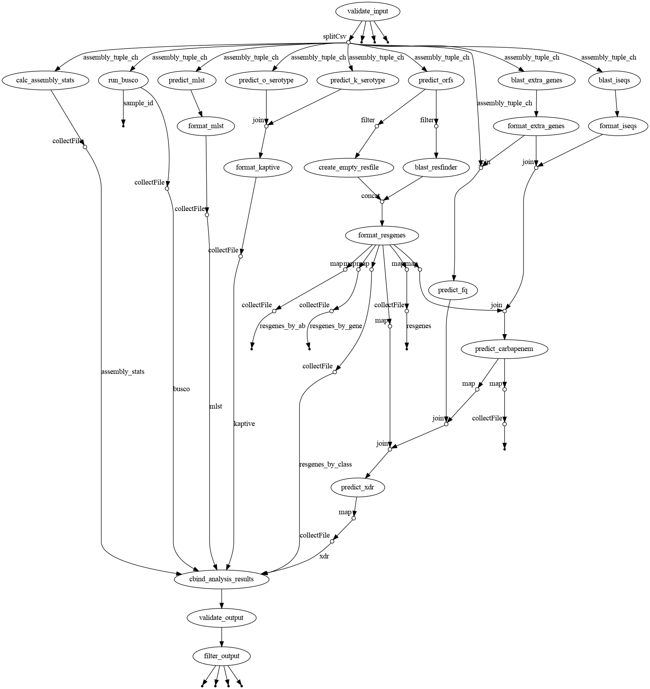

<!-- README.md is generated from README.Rmd. Please edit that file -->

# aci

<!-- badges: start -->

This repository contains all pipelines and scripts for the article:
\<TODO: ARTICLE REFERENCE HERE\>

## Repository Structure

This repository contains:

- A pipeline launcher for predicting a number of genomic features for a
  set of A. baumannii genomes (main.nf)
- A pipeline launcher for analysing a set of A. baumannii genomes with
  genomic features (post.nf)

The pipelines use both published software tools and also code developed
for this project.

- Scripts used or intended to be used within any of the automated
  pipelines are stored in `bin`.
- Other scripts are stored in `scripts`.
- R functions that are used in R scripts are stored in `R`, their man
  pages are stored in `man`.

## Software Dependencies

The automated pipelines run under Linux and require Java 11 or later as
well as Singularity (<https://sylabs.io/singularity/>). Processes in the
pipeline are fully containerised. To see which process uses which
container, see section “Container versions” in the pipeline launchers.

R scripts and R functions are OS independent and may run on any
platform. Furthermore, R functions are organised in an R package-like
structure. You can load these functions into an R session:

``` r
# load R functions
library(devtools)
load_all("<path to downloaded repo>")

# TODO prepare R package from R functions, release on GitHub, change this to devtools::install_github()
```

**IMPORTANT!!!** A large fraction of the code is written in R. Due to
internal R stuff the containerised pipelines may throw errors on your
system if your working directory is in your `/home`. To avoid this risk
completely and ensure the pipelines work as intended, make sure you do
not have R v4.2 packages installed in your `/home`.

## Predicting genomic features - main.nf

A visual representation of the pipeline



### How to use the pipeline

TODO

## Analyse genomes with predicted genomic features - analysis.nf

A visual representation of the pipeline


### How to use the pipeline

The pipeline requires a number arguments. It is recommended to define
these in a dedicated `yaml` file and use this file when running the
pipeline. An example for such a file can be found in
`analyse_example.yaml`.

    nextflow run analyse.nf -params-file analyse_example.yaml

The following arguments are required:

*assembly_summary*

File path to a typing summary table, one row for each genome and columns
describing properties of each genome. The following columns are
required:

- assembly: character; the Assembly ID of the genome, e.g. GCA…
- mlst: character; Multi Locus Sequence Type, syntax ST\[0-9\]+,
  e.g. ST2.
- k_serotype: character; Kaptive K locus type, syntax KL\[0-9\]+,
  e.g. KL3.
- k_confidence: character; Kaptive K locus type confidence, “None”,
  “Low”, “Good”, “High”, “Very High”, or “Perfect”.
- kraken2_taxid: integer; The taxon (species) for the assembly predicted
  by Kraken2.
- coverage: numeric; Assembly coverage.
- busco_complete_perc: numeric; BUSCO Complete score in percentage
  (0-100%).
- genome_size: integer; overall number of bases.
- GC content: numeric; ratio of Gs and Cs (0-1).
- contig_count: integer; number of contigs.
- longest_contig: integer; length of the longest contig.
- N50: integer;
- N95: integer;
- n_count: integer; number of ambiguous nucleotides.
- kraken2_taxid_freq: numeric; Percentage assigned to the Kraken2 taxon
  classification (0-100).
- continent: character;
- region23: character; region23 defined with the R package
  `countrycode`.
- country: character;
- city: character;
- human_related: logical; whether or not the isolate is human related
  e.g. clinical.
- crab: logical; whether or not the isolate is a high risk isolate.
